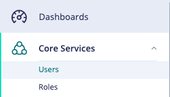
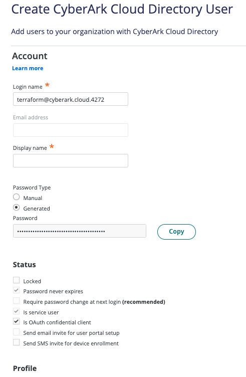
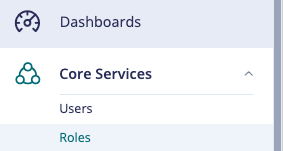
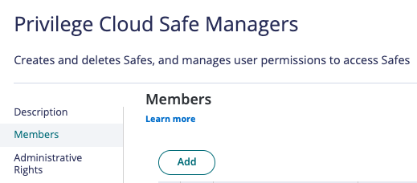
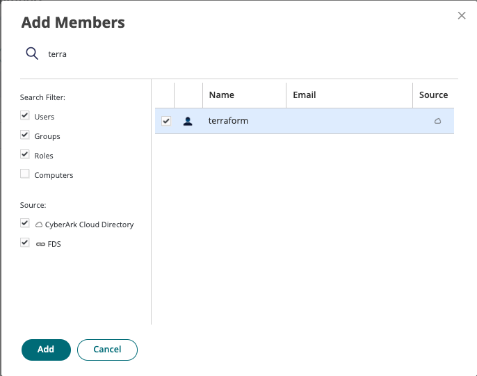

# This is an unofficial Terraform Provider for interacting with CyberArk Privilege Cloud Resources.
# This is not production, or even development code. This should **only** be used in a test environment.

This release is currently in **beta**. 

Please see [Docs](/docs/index.md) for current supported resources and data providers

# Configurable Environment Variables
*We do not support configuring optional properties via environment variables, these must be implicitly defined.*

## Provider
- CYBERARK_PROVIDER_TENANT
- CYBERARK_PROVIDER_CLIENT_ID
- CYBERARK_PROVIDER_CLIENT_SECRET
- CYBERARK_PROVIDER_DOMAIN
## Accounts
- CYBERARK_ACCOUNT_CUSTOM_NAME
- CYBERARK_ACCOUNT_USERNAME
- CYBERARK_ACCOUNT_PLATFORM
- CYBERARK_ACCOUNT_SAFE
- CYBERARK_ACCOUNT_SECRETTYPE
- CYBERARK_ACCOUNT_SECRET

# Set up Terraform User
- Log into Identity Administration and navigate to the Users Widget

- Create New User

- Populate User Data

- Navigate to the Roles Widget

- Add the new user to the Privilege Cloud Safe Managers Role

- Search for the Terraform User and Add

## Usage instructions

**TBD**
